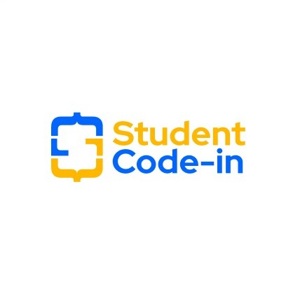

# [Student Code In](https://scodein.tech/)

## Welcome
* [Introduction](#introduction)
* [Why SCI?](#why-sci)
* [What is our vision?](#what-is-our-vision)
* [How are we doing it?](#how-are-we-doing-it)
* [Contribution](#contribution)
* [Code of Conduct](#code-of-conduct)
* [License](#license)
* [Contact Us](#contact-us)

## Introduction
Student Code-in is a 8 weeks long open source project. 
In this,all the registered participants would get an exquisite opportunity to interact with the mentors and the Organizing Team. 

## Why SCI?
- We have highly skilled mentors and a devoting support system with excellent technical knowledge and experience in making you aware about latest tricks and techniques required for your project.

- We invest continuously in training to be able to respond to any new technology challenges and demands from the students

- We offer strong sense of spirit to all those who come to the door of Student code-in. There are a host of projects that will develop heights of confidence within you in the field of “OPEN SOURCE”.

## What is our vision?
   - STUDENT CODE-IN is founded with a vision to promote all round information to those keen students who are here in the globe finding a way for their obstacle.
   - At STUDENT CODE-IN we have strived to a system that supports and encourages you with varied quality of experiences offered by expert mentors who are the backbone of this initiative.
   - It is our firm believe that as a part of STUDENT CODE-IN you will get array of opportunites to develop your skills in numerous ways.
   - We assure you that this platform gives you a touch of redefined excellence,vision and wings to your dreams of being a developer.

## Contribution
If you’re interested in the project, feel free to open an issue, create a PR, or just come say hi and tell us more about yourself.
1. Fork it (<https://github.com/StudentCode-in/StudentCode-in.github.io>)
2. Clone it ( `git clone https://github.com/StudentCode-in/StudentCode-in.github.io.git` )
3. Create your feature branch ( `git checkout -b feature/fooBar` )
4. Commit your changes ( `git commit -am 'Add some fooBar'` )
5. Push to the branch ( `git push origin feature/fooBar` )
6. Create a new Pull Request

## Code of Conduct
We request you to follow our [Code of Conduct](CODE_OF_CONDUCT.md)

## License
This project is licensed under the MIT License - you can see [LICENSE](https://github.com/StudentCode-in/StudentCode-in.github.io/blob/master/LICENSE) file for details.

## Contact Us
If you have anything to share, anything at all, feel free to drop by the Student Code In  on Discord and say hi. 
We would love to hear from you. 
You can also contact [Archit](https://github.com/itsallarchit) by email [archit@scodein.tech](mailto:archit@scodein.tech?Subject=Student-Code-In-Discuss) or 
[Akanksha](https://github.com/akanksha-raghav) by email [akanksha@scodein.tech](mailto:akanksha@scodein.tech?Subject=Student-Code-In-Discuss) or on [Twitter](https://twitter.com/studentcod)
